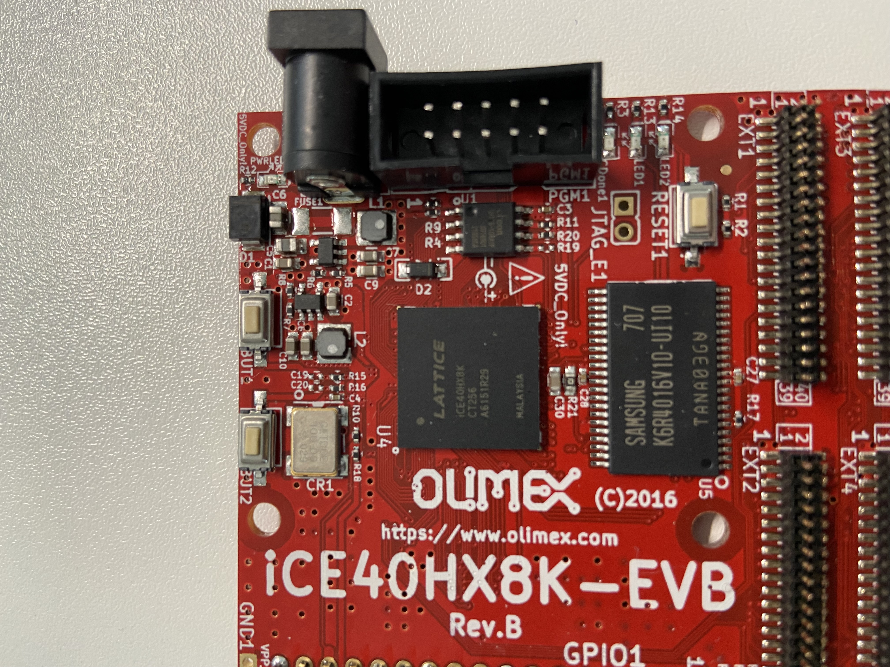
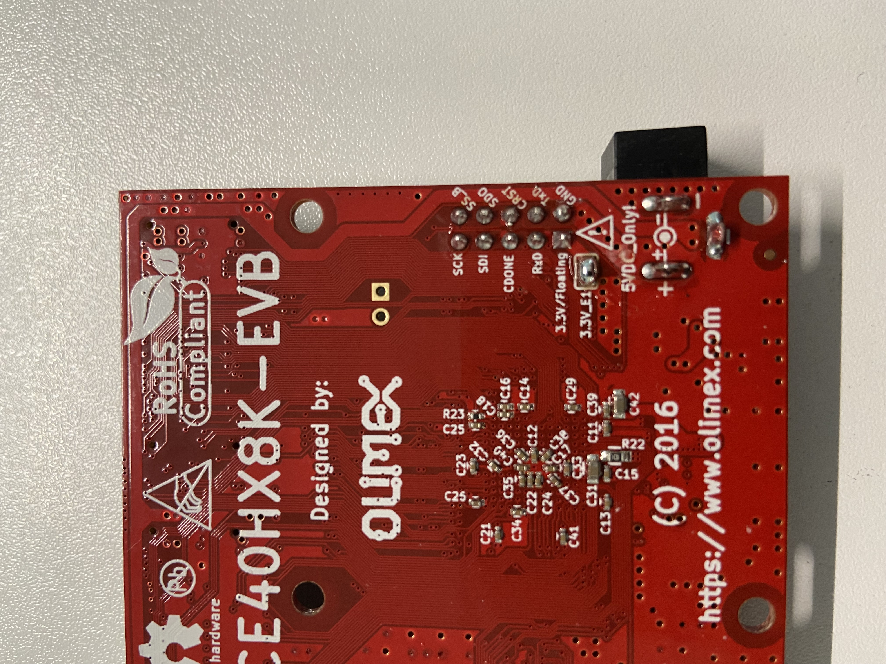
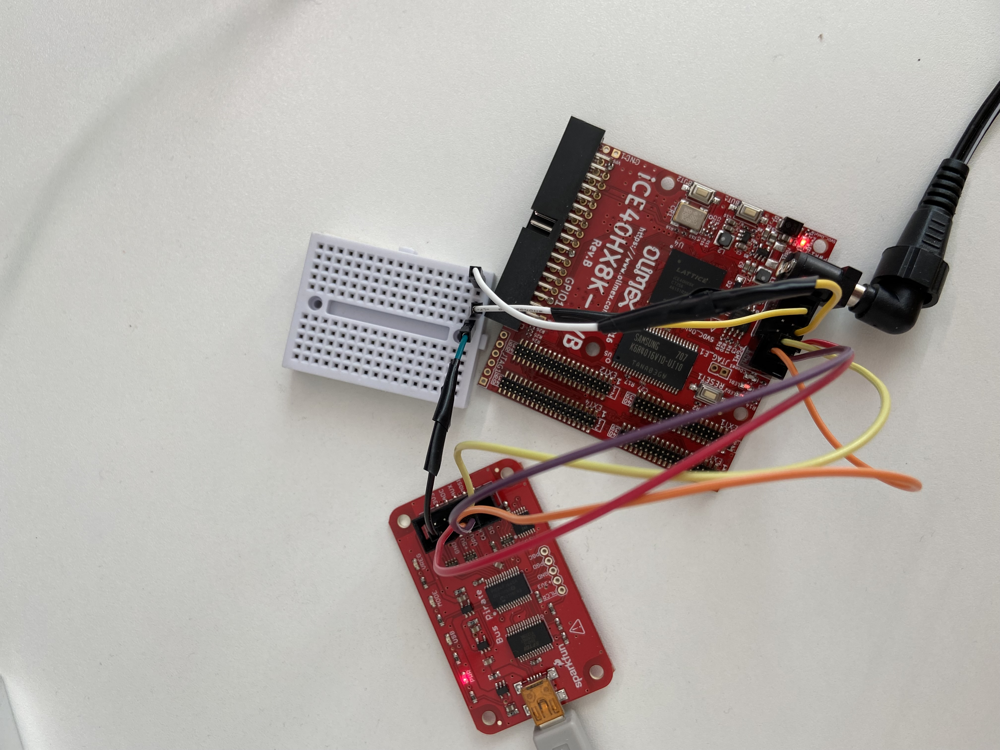
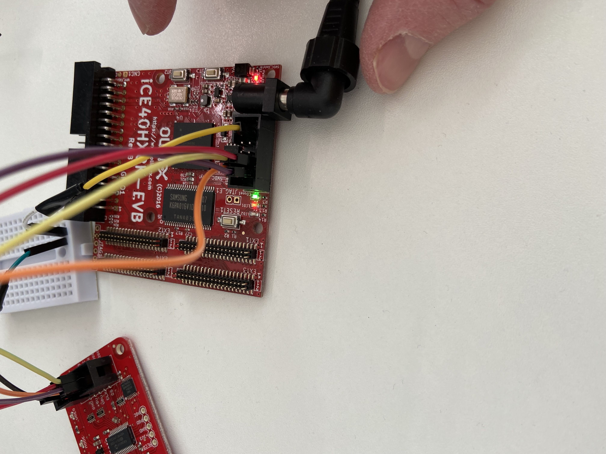
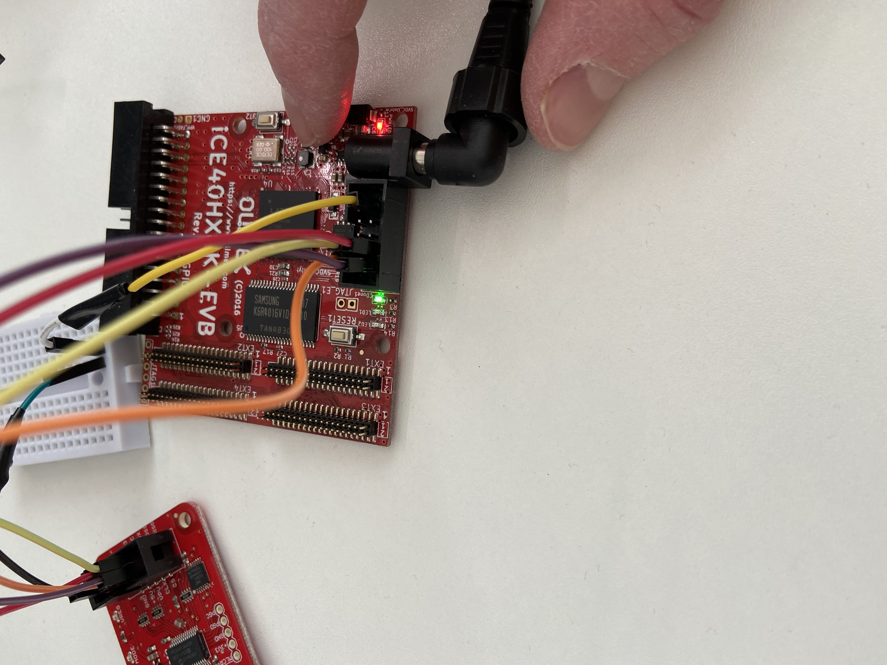

## Field Programmable Gate Array 
Are application specific integrated circuits (ASIC) that can be programmed and
reprogrammed.

One reason for using one instead of a general purpose microcontroller (MCU) is
when one wants to be able to perform tasks in parallell (more than one thing at
a time).

A FPGA does not have an MCU built in, but one could create an MCU using an FPGA. 
A more common case is to have an FPGA offload an MCU and have the FPGA do
computational heavy work and let the MCU handle I/0 stuff.

An FPGA contains logical blocks which can be configured and connected by
existing wires/lines in/out from these blocks. Nothing physical changes on the
boards themselves. The configuration is stored in RAM.
Logic gates like AND, OR, XOR, NOT are used to build can be used to describe
any digital circuit. And these gates can be built using transistors, for example
and AND gate can be build with transistors like we [done](../README.md#and-gate) previously


### Application Specific Integrated Circuit (ASIC)
Is a custom built chip designed which is not reprogrammable. FPGAs can be be
used in the initial process to write and test a design before manufacturing a
APIC.

### Configurable Logic Block (CLB)
Is a fundamental piece of an FPGA and is what gives an FPGA its ability to take
on different hardware configurations. An FPGA can be viewed as many(thousands)
of these CLBs close togther and these can be programmed.
A single CLB is made up of discrete logic components like flip-flops, and/or
look up tables (LUTs).

### Hardware Description Language (HDL)
Provide a way of describing the behaviour without having to specify any
implementation. Note what we describing hardware in this case and this enable
us to verify the design before any hardware is constructed.
After this abstract design has been verified, we can use a tool to process
this design into a technology-specific gate-level implementation which is called
synthesis. The output of synthesis is a netlist specific to a semiconductor
technology.

### Verilog
Is a Hardware Description Language (HDL) used to describe a digital system.
Uses a `.v` file extension.

```
always @(event) begin
  [statement]
end
```
The @ and content the parenthesis means that this block will be triggered at
the condition specified in the parenthesis.

Blocks can be named:
```
always begin: Something
...
end : Something

```

Variables of type net:
* wire : connects instances
* tri : alias/same as wire
* wand : wired AND
* triand : alias/same as wand
* tri0 : nets that pull up when not driven
* tri1 : nets that pull down when not driven

### SystemVerilog
Is a superset of Verilog.

Uses a `.sv` file extension.

### Combinational logic
Does not require a clock to operate, for example an AND gate.

### Sequential logic
Does require a clock to operate, for example a D Flip-flop.

### Sensitivity list
```
       Sensitivity list
            ↓         
         |<---->|
always @ (A or B) begin
  and_gate = A & B;
end
```
Is a list of all the signals which will cause the always block to execute.
The same can also be accomplished without using combinational logic and instead
using `assign`:
```
assign and_gate = A & B;
```

```
always @ (posedge clock) begin
  and_gate <= A & B;
end
```
This will cause the and_gate to only be updated on a raising edge of the clock.

### Register Transfer Level (RTL)
Implies that Verilog code describes how data is transformed as it flows from
register to register.


### Synthesesis
Is the process of taking an abstract specification of desired curcuit behaviour
which could be in the form of a RTL and turn that into a design implementation
in the form of logic gates. This is done using a tool.

### Place and Route
This is a stage in the design of FPGAs and is composed of two steps, namely
a place step and a route step.
The place steps is about figuring out where electrical components, ciruitry, and
logic elements are to be placed. Routing is then about hooking up these
components.


### Yosys
[Yosys](https://yosyshq.net/) is a framework for Verilog RTL syntheseis and
can handle Verilog-2005.
```console
$ sudo dnf install -y yosys

$ yosys -V
Yosys 0.14+51 (git sha1 UNKNOWN, gcc 11.2.1 -O2 -fexceptions -fstack-protector-strong -m64 -mtune=generic -fasynchronous-unwind-tables -fstack-clash-protection -fcf-protection -fPIC -Os)
```

Example of synthesis:
```console
$ yosys -p "read_verilog first.v; synth_ice40 -blif first.blif"
```

### nextpnr
[nextpnr](https://github.com/YosysHQ/nextpnr) is a tool for Place And Route.
```console
$ git clone https://github.com/YosysHQ/nextpnr nextpnr
$ cd nextpnr
$ sudo dnf install -y boost-devel boost-python3-devel eigen3-devel
$ make -j4
```

Example of Place And Route:
```console
$ nextpnr-ice40
```

### xilinx
[xilinx](https://www.xilinx.com/) is a company that is now owned by AMD.

### icestorm
[https://clifford.at/icestorm](https://clifford.at/icestorm).

```console
$ sudo dnf install -y libftdi-devel
$ git clone https://github.com/YosysHQ/icestorm.git icestorm
$ cd icestorm
$ make -j4
$ sudo make install
```

### Multiplexer
Can be built using multiple AND and one OR gate and it selects a single output
depending on the selected value:
```
     +----\
a    |     \
-----|      \
     |       |
     |       |
     |       |------ g
     |       |
b    |       |
-----|      /
     |     /
     +----/
        |
s       |
--------+

            +---+
a ----------|AND|-------------+
     +---+  |   |             |
   +-|NOT|--|   |             |    +------+  
   | +---+  +---+             +----| OR   |
   |        +---+                  |      |---- Q
b -|--------|AND|------------------|      |
   +--------|   |                  |      |
   |        +---+                  +------+
   |                        
s -+
```
So in the above we have 2 inputs, a, b and we can select one of those using
0, or 1. The truth table for this looks like this:
```
+---------------+
| s | a | b | q |
|---------------|
| 0 | 0 | 0 | 0 |
|---------------|
| 0 | 0 | 1 | 0 |
|---------------|
| 0 | 1 | 0 | 1 |
|---------------|
| 0 | 1 | 1 | 1 |
|---------------|
| 1 | 0 | 0 | 0 |
|---------------|
| 1 | 0 | 1 | 1 |
|---------------|
| 1 | 1 | 0 | 0 |
|---------------|
| 1 | 1 | 1 | 1 |
+---------------+
```
Notice that when we set s=0, regardless of what value we specify for b, the
value of a is set as the output q. So the first two rows can be merged to one
as it does not matter that b=1 in that case. And the same goes for when we set
s=1:
```
+---------------+             X = ignored, or does not matter.
| s | a | b | q |
|---------------|
| 0 | 0 | X | 0 |
|---------------|
| 0 | 1 | X | 1 |
|---------------|
| 1 | X | 0 | 0 |
|---------------|
| 1 | X | 1 | 1 |
|---------------|
```

### Lookup tables (LUT)
These allow for performing arbitary logic. They can implement boolean
algebra equations for the number of inputs that the LUT. 

So a LUT2 could look like this:
```
                +---------------+
                | 0 | 0 | 0 | 1 |     (SRAM)
                +---------------+
                 |    |   |   |
(terms)          |    |   |   |
 a ----------- -------------------
               \ 00   01  10  11 /    (2-1 Multiplexer)
 b -----------  -----------------
                         |
                         q
```
The inputs a and b are used to 2² 1-byte digital memory that stores the truth
table. Now, the inputs `a` and `b` would be the same for both `a & b` and for
a ^ b`. If we want to instead implement the OR (`^`), we (well actually the
designer tool will do this for us) only have to update the 1-bit digital
memory to reflect the different truth table:
```
                +---------------+
                | 0 | 1 | 1 | 1 |     (SRAM)
                +---------------+
                 |    |   |   |
(terms)          |    |   |   |
 a ----------- -------------------
               \ 00   01  10  11 /    (2-1 Multiplexer)
 b -----------  -----------------
                         |
                         q
```

### Flip-Flop
Besides LUTs flip-flops are also a main part that makes up an FPGA. I went
through how these work in [Gated D-Latch](./fault-injection.md#gated_d-latch).

Are also called registers, and are able to keep a state which means that it
has information about what happened previously. Wherea  LUTs can act on the
current input but they don't have any information about what happend earlier.

### Clocks
An FPGA will typically have several clock signals to allow different areas
accross the FPGA to operate at different speeds.

### Mechanical bouncing
This is an issue with the first button program written where we want to have a
button that controls an LED.
This is what we want to have happpen:
```
            stable (LED turns on or off depending on the previous state)
       +---------------
       |
       |
-------  <--- switch toggles
```
But in the real world this is what actually happens:
```
                  stable (LED turns on or off depending on the previous state)
       ++ ++ ++ +-----------
       || || || |
       || || || |
------- +- +- +-
       Glitches
```
The glitches happen during a period before the signal goes stable and is
something the FPGA notices. This is only a short period like say a few 100 micro
seconds or 1 millisecond. This is called bounceing.
We want to avoid this as otherwise our button not always turn the button on/off
when we press the button. Actually it is always toggling the state, which is
done on the falling edge but that now occurs multiple times instead of in the
expected case only once. And this happens so fast that we can't see it and it
might end up in the same state that is started in which looks like there was
nothing happening at all.

We need someway to wait until the signal become stable, or delay for a short
period of time to avoid this bouncing. For this we need to count clock signals.

### Propagation delay
An electrical signal does not travel instantaniously, it takes a small amount
of time to travel on the wire. The signal travels about 30 cm in one nano
second. Now, inside an FPGA there are many small wires and these can all add up
and become more that 30cm. 

Is the amount of time amount of time it takes for a signal to pass between two
flip-flops. And we also have to factor in the sequential between them.
TODO: explain this further with some diagrams.

### Setup time
A signal that travels through a wire can change from 0 to 1, or from 1 to 0
which can be the input to a flip-flop. The flip-flop needs the input to be in a
stable state to correctly be able to sample the value. It has to be either 0 or
1 and not transistioning in between 0 or 1. Just because we draw clock diagrams
with square waves does not mean that the signals change instantaniously from 0
to 1 and vice verca. Setup time is an amount of time the input signal needs to
be stable before the clock edge (before it will be sampled).

### Hold time
Is similar to setup time but this is an amount of time that the intput signal
needs to be stable after the clock edge.


## FPGA Example
The device I'm using is an
[iCE40HX1K-EVB](https://www.olimex.com/wiki/ICE40HX1K-EVB):



This FPGA can be powered using a 5V barrel connector or it can be powered using
3.3V pin, but notice that this is only possible if enabled by soldering the
bridge on the bottom side of the board:



I actually opted to use a 5V power supply instead of this above 3.3V pin.

### Building
Synthesis, Place and Route, and build bitstream:
```console
$ make first.bin
```
This will produce first.bin which can then be used to flash the FPGA.

### Connections/Pins
I used the following connections on the Bus Pirate and iCE40HX8K-EVB:
```
                  +------------------------------------+
     Bus Pirate   |            iCE40HX8K-EVB           |
     +---------+  |            +-----------+           |
 +---|GND  3V3 |  |    +-------|SS_B  SCK  |-------+   |
 |   |+5V  ADC |  |  +-|-------|DSO   SDI  |-------|---+
 |   |VPU  AUX |  |  | | +-----|CRST  CDONE|       |
 | +-|CLK  MOSI|--|--+ | |     |TxD   RxD  |       |
 | |+|CS   MISO|--+    | |   +-|GND   3.3V |       |
 | ||+---------+       | |   | +-----------+       |
 | |+------------------+ |   |                     |
 | +---------------------|---|---------------------+
 |                +--------+ |
 +----------------|        |-+
                  |        |
                  +--------+
                  Breadboard
```
The reason for having the breadboard is that GND on Bus Pirate needs to be
connected to GND and CRST.


Notice the short wires which is required as this is using SPI and there is a
limit on the maxium length (something like 20 cm).


### Flashing
Flash the device
```console
$ make led_flash_rom
flashrom -p buspirate_spi:dev=/dev/ttyUSB0,spispeed=2M -w led_padded.bin
flashrom v1.2 on Linux 5.13.14-200.fc34.x86_64 (x86_64)
flashrom is free software, get the source code at https://flashrom.org

Using clock_gettime for delay loops (clk_id: 1, resolution: 1ns).
===
SFDP has autodetected a flash chip which is not natively supported by flashrom yet.
All standard operations (read, verify, erase and write) should work, but to support all possible features we need to add them manually.
You can help us by mailing us the output of the following command to flashrom@flashrom.org:
'flashrom -VV [plus the -p/--programmer parameter]'
Thanks for your help!
===
Found Unknown flash chip "SFDP-capable chip" (2048 kB, SPI) on buspirate_spi.
Reading old flash chip contents... done.
Erasing and writing flash chip... Erase/write done.
Verifying flash... VERIFIED.
rm led.asc
```

After flashing we can remove all the wires, or just remove the wire connected to
CRST which is the reset pin.

The first example, [led.v](./led.v) is a LED1 that is controlled but BUT1.

Now this works most of the time but there is an issue with how switches work
in reality vs how they work in theory which I've written about before in
[Mechanical bouncing](../doc/fpga.md#mechanical_bouncing).

The second example, [led_non_no_bounce.v](./led_no_bounce.v) is the same as
the previous example but takes care of the issue with mechanical bouncing.



Now, if we press button `BUT1`, LED1 will turn on:


And, if we press button `BUT1`, LED1 will turn off again (toggle):


### Troubleshooting
I'm having issues flashing the device and trying to figure out what is going
on.
I can read the flash memory using:
```console
$ flashrom -p buspirate_spi:dev=/dev/ttyUSB0,spispeed=1M -r original2.bin
flashrom v1.2 on Linux 5.13.14-200.fc34.x86_64 (x86_64)
flashrom is free software, get the source code at https://flashrom.org

Using clock_gettime for delay loops (clk_id: 1, resolution: 1ns).
Found Eon flash chip "EN25QH16" (2048 kB, SPI) on buspirate_spi.
Reading flash... done.

```
I can try to verify the read contents using:
```console
$ flashrom -p buspirate_spi:dev=/dev/ttyUSB0,spispeed=1M -v original2.bin 
flashrom v1.2 on Linux 5.13.14-200.fc34.x86_64 (x86_64)
flashrom is free software, get the source code at https://flashrom.org

Using clock_gettime for delay loops (clk_id: 1, resolution: 1ns).
Found Eon flash chip "EN25QH16" (2048 kB, SPI) on buspirate_spi.
Verifying flash... FAILED at 0x000d6803! Expected=0xfd, Found=0xff, failed byte count from 0x00000000-0x001fffff: 0xafc
```

When trying to erase the flash I get:
```console
$ flashrom -p buspirate_spi:dev=/dev/ttyUSB0,spispeed=2M -E
flashrom v1.2 on Linux 5.13.14-200.fc34.x86_64 (x86_64)
flashrom is free software, get the source code at https://flashrom.org

Using clock_gettime for delay loops (clk_id: 1, resolution: 1ns).
Found Eon flash chip "EN25QH16" (2048 kB, SPI) on buspirate_spi.
Erasing and writing flash chip... FAILED at 0x00056000! Expected=0xff, Found=0x00, failed byte count from 0x00056000-0x00056fff: 0x800
ERASE FAILED!
```

Running this multiple times I get different error messages:
```console
$ flashrom -p buspirate_spi:dev=/dev/ttyUSB0,spispeed=1M -E
flashrom v1.2 on Linux 5.13.14-200.fc34.x86_64 (x86_64)
flashrom is free software, get the source code at https://flashrom.org

Using clock_gettime for delay loops (clk_id: 1, resolution: 1ns).
Found Eon flash chip "EN25QH16" (2048 kB, SPI) on buspirate_spi.
Erasing and writing flash chip... FAILED at 0x000e4001! Expected=0xff, Found=0xfc, failed byte count from 0x000e4000-0x000e4fff: 0x7ff
ERASE FAILED!
Looking for another erase function.
```
If the error had been the same every time that could indicate an issue with
the FPGA like write-protection or something, but since the errors is different
everytime this is more likely a hardware issue. Hardware as in the connection or
the programmer (Bus Pirate). 

I finally managed to get this working and the issue was the length of the
cables I was using. I had to make extensions as I needed male connectors for
the breadboard and from there female connectors to the devices. This made the
cables too long for SPI. 
What I did to work around this was take two cables and cut them and connected
them so they are shorter and that got things working as expected. The issue here
is that with these lengths, the usage of two connections, I was getting close to
the 20cm which is getting close to the SPI max.

